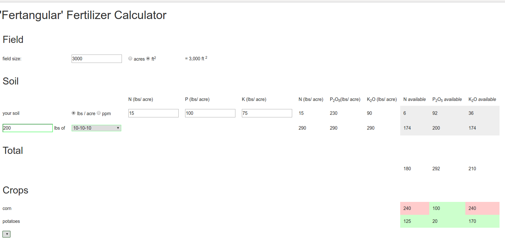

# Fertangular

A simple browser based fertilizer calculator, created as a demo project in Angular.js

View [fertangular on GitHub pages](http://tjamescorcoran.github.io/fertangular/) or run locally:

  cd <here> ; python -m SimpleHTTPServer 8000

## Example of use

## History

* 22 June 2016 tjamescorcoran@gmail.com - created
